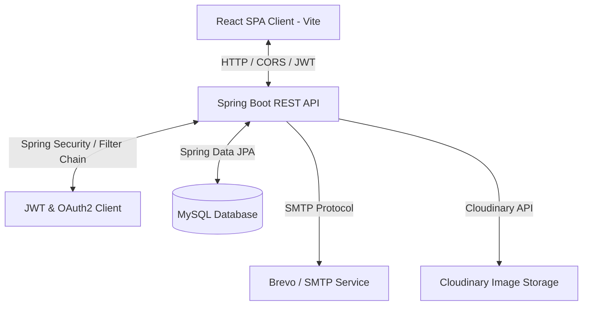

# BytesBlogs: Full-Stack Developer Blog Platform

BytesBlogs is a high-performance, full-stack blogging application tailored for developers. It features a modern React Single Page Application (SPA) frontend and a secure, robust Spring Boot backend. Authors can write posts in Markdown with live syntax highlighting, organize content via categories and tags, upload images to Cloudinary, sign in with Google OAuth2 or OTP-verified email verification, and administrators can manage users and posts using a sleek analytics-enabled dashboard.

---

<p align="center">
  
  
  
  
  
  
</p>

---

## Table of Contents
1. [Key Features](#key-features)
2. [Architecture Overview](#architecture-overview)
3. [Technology Stack](#technology-stack)
4. [Project Directory Map](#project-directory-map)
5. [Local Development Setup](#local-development-setup)
6. [Environment Configurations](#environment-configurations)
7. [Dockerization Guide](#dockerization-guide)
8. [Unified Production Build (Topology A)](#unified-production-build-topology-a)
9. [Postman Integration Testing](#postman-integration-testing)

---

## Key Features

*   **Secure Sessions & Auth**: JWT authentication utilizing secure, stateless HTTP-Only cookies for robust cross-site scripting (XSS) and cross-site request forgery (CSRF) protection.
*   **OTP & OAuth2 Sign-In**: Supports single-click Google Sign-In as well as password-less logins via secure OTP (One-Time Password) codes sent straight to the user's inbox.
*   **Markdown Editor**: Real-time parsed Markdown view enabling developers to write technical posts with instant preview and syntax highlighting for major programming languages.
*   **Cloud Storage**: Seamless media upload handling directly integrated with Cloudinary for fast CDN-driven image delivery.
*   **Admin Console**: Access statistical oversight graphs (users growth, category counts, top stories) and role control centers to manage post moderation and users accounts.
*   **Interactions**: Built-in views, likes, and comment threads for maximum community engagement.

---

## Architecture Overview

The following diagram illustrates the network flow and service communication:



---

## Technology Stack

### Backend Technologies
| Component | Technology | Description |
| :--- | :--- | :--- |
| **Language** |  | Core application runtime environment (Java 25) |
| **Framework** |  | Core REST API backend architecture (v4.0.6) |
| **Security** |  | Stateless authentication using JWT cookies & Google OAuth2 |
| **Database** |  | Main relational database management system |
| **ORM** |  | Data access layer, entity mappings and query parsing |
| **Build System** |  | Project dependencies compilation and builder |
| **Cloud CDN** |  | Distributed media upload hosting API |
| **Mail Dispatcher** |  | SMTP mailing engine for verification OTP dispatch |

### Frontend Technologies
| Component | Technology | Description |
| :--- | :--- | :--- |
| **SPA Library** |  | Component-driven user interface rendering (v19) |
| **Build Engine** |  | Bundler & high-speed development server (v8) |
| **Style Sheet** |  | Utility-first responsive spacing layout guidelines (v3.4) |
| **Components** |  | Unstyled accessible dropdowns, dialogs, and panels |

---

## Project Directory Map

```text
├── frontend/                  # React Frontend Application
│   ├── public/                # Static assets & favicons
│   ├── src/
│   │   ├── components/        # UI components (Header, Footer, LogoBug)
│   │   ├── context/           # React contexts (Auth, Theme)
│   │   ├── pages/             # Page views (Auth, BlogDetail, Admin Console)
│   │   ├── services/          # HTTP client APIs
│   │   └── App.jsx            # Routing and modal coordination
│   ├── tailwind.config.js     # Styles design token configuration
│   └── package.json           # Frontend dependency manifest
│
└── spring-backend/            # Spring Boot Backend REST Service
    ├── src/main/java/com/blogapp/
    │   ├── controller/        # REST Controllers (Auth, Blogs, Comments)
    │   ├── dto/               # Request & Response Data Objects (DTOs)
    │   ├── model/             # JPA Entity Definitions
    │   ├── repository/        # Spring Data JPA Repository interfaces
    │   ├── security/          # Spring Security, JWT validation filters
    │   └── service/           # Logic implementations
    ├── src/main/resources/
    │   ├── application.yaml   # Main environment configurations
    │   └── application-dev.yaml # Dev configurations (with environment overrides)
    ├── Dockerfile             # Multi-stage containerization build file
    ├── postman_collection.json # Integrated API testing collection
    └── pom.xml                # Maven build dependencies config
```

---

## Local Development Setup

### Prerequisite Checklist
*   **Java:** JDK 25 installed
*   **NodeJS:** Version 18 or higher (along with npm)
*   **Database:** MySQL Server instance running locally

### Running the Backend
1. Create a MySQL database instance named `blog_db`:
   ```sql
   CREATE DATABASE blog_db;
   ```
2. Navigate to `spring-backend/src/main/resources` and configure your credentials inside `application-dev.yaml`.
3. Start the Spring Boot application using the wrapper:
   ```bash
   cd spring-backend
   ./mvnw spring-boot:run
   ```

### Running the Frontend
1. Navigate to the `frontend` folder:
   ```bash
   cd frontend
   ```
2. Install npm dependencies:
   ```bash
   npm install
   ```
3. Start the Vite server:
   ```bash
   npm run dev
   ```
4. Open your browser to `http://localhost:5173`. Vite is pre-configured to proxy API requests to your local backend on port `8080`.

---

## Environment Configurations

For deployments or container overrides, configure the variables listed below:

| Variable Name | Description | Default / Example |
| :--- | :--- | :--- |
| `PORT` | Backend server port | `8080` |
| `DB_URL` | MySQL Connection URL | `jdbc:mysql://localhost:3306/blog_db` |
| `DB_USERNAME` | Database username | `root` |
| `DB_PASSWORD` | Database password | `your_mysql_password` |
| `JWT_SECRET` | 256-bit Base64 JWT Secret Key | *Generate a secure random string* |
| `JWT_EXPIRATION` | JWT token expiration time (in ms) | `86400000` (1 day) |
| `GOOGLE_CLIENT_ID` | Google Console OAuth Client ID | `your-google-client-id` |
| `GOOGLE_CLIENT_SECRET` | Google Console OAuth Client Secret | `your-google-client-secret` |
| `MAIL_HOST` | SMTP Server Host Address | `smtp.gmail.com` or Brevo SMTP |
| `MAIL_PORT` | SMTP Server Connection Port | `587` |
| `MAIL_USERNAME` | Mailer account username | `example@gmail.com` |
| `MAIL_PASSWORD` | Mailer account SMTP password / app password | `your-app-password` |
| `MAIL_FROM` | Origin mail address for notifications | `no-reply@bytesblogs.com` |
| `CLOUDINARY_CLOUD_NAME` | Cloudinary Account Cloud Name | `your-cloud-name` |
| `CLOUDINARY_API_KEY` | Cloudinary API Key | `your-api-key` |
| `CLOUDINARY_API_SECRET` | Cloudinary API Secret Key | `your-api-secret` |
| `FRONTEND_URL` | Frontend client origin (CORS/Redirects) | `http://localhost:5173` |

---

## Dockerization Guide

### 1. Build the Docker Image
Navigate to your `spring-backend` directory and compile the multi-stage image:
```bash
cd spring-backend
docker build -t blog-backend:latest .
```

### 2. Run in Docker Desktop GUI
1. Open **Docker Desktop** and navigate to the **Images** tab.
2. Find `blog-backend:latest` and click the blue **Run** button.
3. Click on **Optional settings** to configure variables:
   * **Container Name:** `blog-backend-container`
   * **Ports:** Map Host Port `8080` to Container Port `8080`.
   * **Environment Variables:** Click the **+** (Add) button to supply:
     * `DB_URL` ➡️ `jdbc:mysql://host.docker.internal:3306/blog_db`
     * `DB_USERNAME` ➡️ `root`
     * `DB_PASSWORD` ➡️ `your_mysql_password`
4. Click **Run**. The app will launch and securely connect to the host MySQL database using the `host.docker.internal` gateway loop.

---

## Unified Production Build (Topology A)

For ease of hosting, compile the frontend assets directly inside the JAR to serve the app on a single unified port:

1. Navigate to the frontend folder and build the assets:
   ```bash
   cd frontend && npm run build
   ```
2. Move static files to the Spring static resource directory:
   ```bash
   cp -r dist/* ../spring-backend/src/main/resources/static/
   ```
3. Compile the package JAR:
   ```bash
   cd ../spring-backend
   ./mvnw clean package -DskipTests
   ```
4. Execute the JAR:
   ```bash
   java -jar target/spring-backend-0.0.1-SNAPSHOT.jar
   ```
   *Your site will be fully accessible at `http://localhost:8080`.*

---

## Postman Integration Testing
To test the API endpoints independently:
1. Locate [postman_collection.json](file:///Users/debapriyodas/Desktop/blog-appV0.1/spring-backend/postman_collection.json) in the `spring-backend` directory.
2. Import it into Postman.
3. Set the `baseUrl` variable to `http://localhost:8080`.
4. Run requests under the **Auth** folder (e.g. Register, Login, OTP confirmation) to verify JWT generation and stateless cookie authorization.
